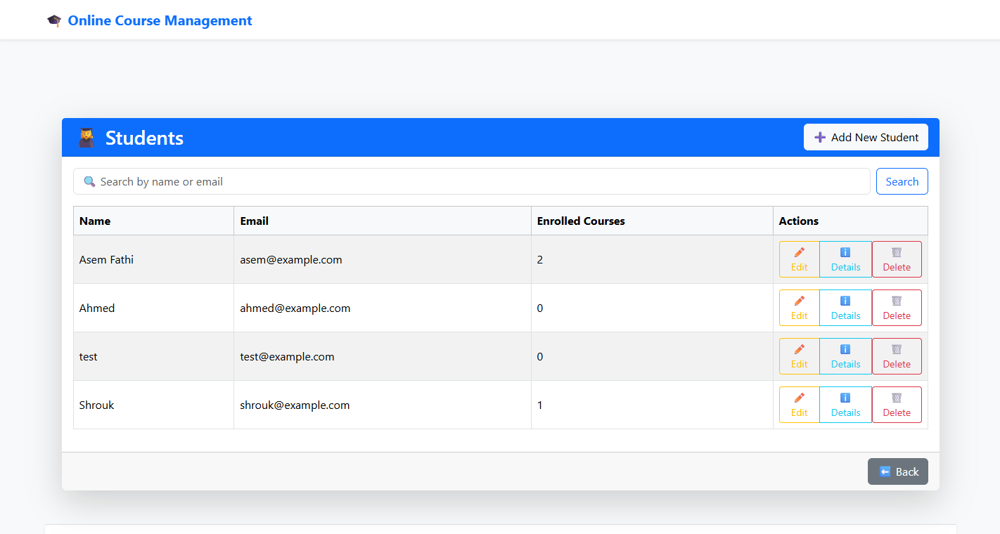

# 🎓 Online Course Management System

An ASP.NET Core Razor Pages application for managing **courses, students, and enrollments** in an educational institution.  
This system is designed for **admins** to manage courses and student data easily, with features like enrollments, CRUD operations, and authentication.

---

## 📌 Features

- **User Authentication** (Login, Register, Logout)
- **Admin Dashboard**
  - Manage Courses (Add, Edit, Delete, View Details)
  - Manage Students (Add, Edit, Delete, View Details)
  - Manage Enrollments (Assign students to courses, Delete enrollments)
- **Responsive UI** using Bootstrap 5
- **Entity Framework Core** for database operations
- **SQL Server Database** integration
- Clean and structured Razor Pages

---

## 🛠️ Tech Stack

- **Backend:** ASP.NET Core 7 Razor Pages
- **Database:** Microsoft SQL Server
- **ORM:** Entity Framework Core
- **Frontend:** Razor Pages + Bootstrap 5
- **Authentication:** ASP.NET Core Identity

---

## 📂 Project Structure

```bash
Online_Course_Management_System/
│-- Models/ # Entity models (Course, Student, Enrollment, User)
│-- Pages/
│ │-- Admin/
│ │ │-- Courses/ # CRUD pages for Courses
│ │ │-- Students/ # CRUD pages for Students
│ │ │-- Enrollments/ # Manage course enrollments
│ │ └-- Index.cshtml # Admin dashboard
│ │
│ │-- Account/ # Login, Register, Logout
│ │
│ │-- StudentPages/ 
│
│-- Data/ # AppDbContext with EF Core
│-- Services/ # All Services
│-- wwwroot/ # Static files (CSS, JS, Bootstrap)
│-- appsettings.json # Database connection string
│-- Program.cs # App startup configuration
```

---

## ⚙️ Setup Instructions

### 1️⃣ Clone Repository
```bash
git clone https://github.com/AsemFathi/Online-Course-Management-System.git
cd Online-Course-Management-System
```

### 2️⃣ Configure Database

Open appsettings.json

Update the connection string to match your SQL Server:

```bash
"ConnectionStrings": {
  "DefaultConnection": "Server=YOUR_SERVER;Database=CourseDB;Trusted_Connection=True;MultipleActiveResultSets=true;TrustServerCertificate=True"
}

```
3️⃣ Apply Migrations
```bash
 dotnet ef database update
```
4️⃣ Run the Application
```bash
dotnet run
```
---

## 📸 Screenshots

### 🔹 Home Page


### 🔹 Register Page


### 🔹 Login Page


### 🔹 Student Dashboard


### 🔹 Admin Dashboard


### 🔹 All Courses Page


### 🔹 Course Details Page


### 🔹 Add New Course Page


### 🔹 Edit Course Page


### 🔹 All Students Page


### 🔹 Student Details Page


### 🔹 Add New Student Page


### 🔹 Edit Student Page


### 🔹 All Enrollments Page


### 🔹 Add New Enrollment Page


---

🚀 Future Enhancements

✅ Role-based authorization (Admin / Student roles)

✅ Student portal to view enrolled courses

✅ Payment integration for course fees

✅ Email notifications for enrollments
